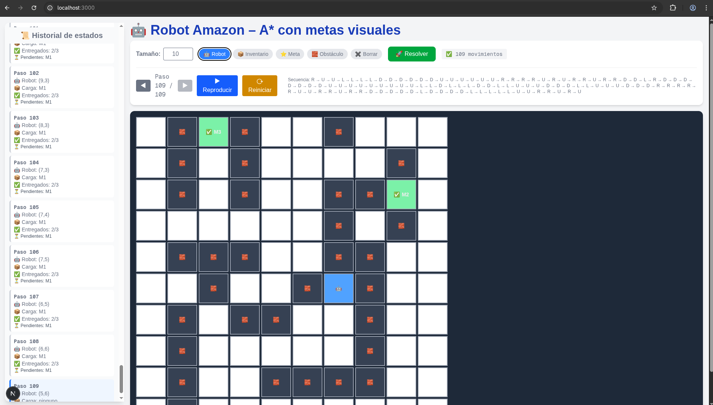

# Amazon Robot - A* implementation

This NextJS application is an academic implementation of the A* heuristic search which aims to solve the problem of moving racks of products from an starting point to a final position.

## Getting Started

Install dependencies:

```bash 
npm i
```

Then, run the development server:

```bash
npm run dev
# or
yarn dev
# or
pnpm dev
# or
bun dev
```

Open [http://localhost:3000](http://localhost:3000) with your browser to see the result.



